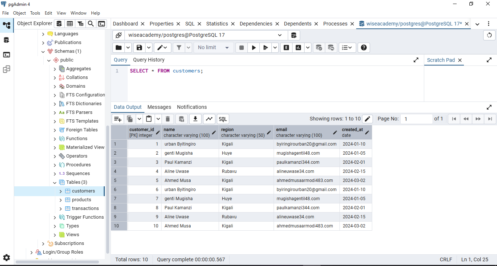
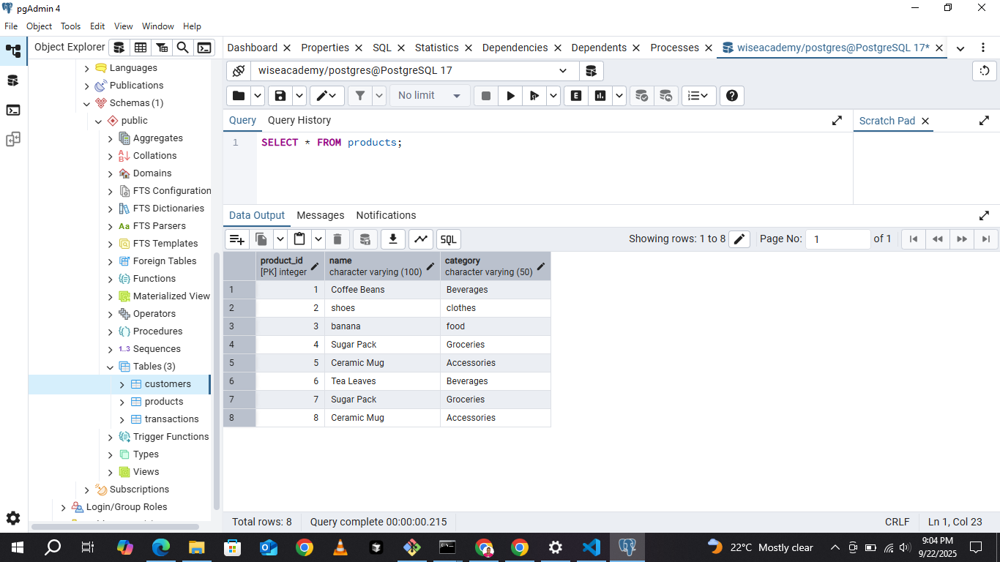
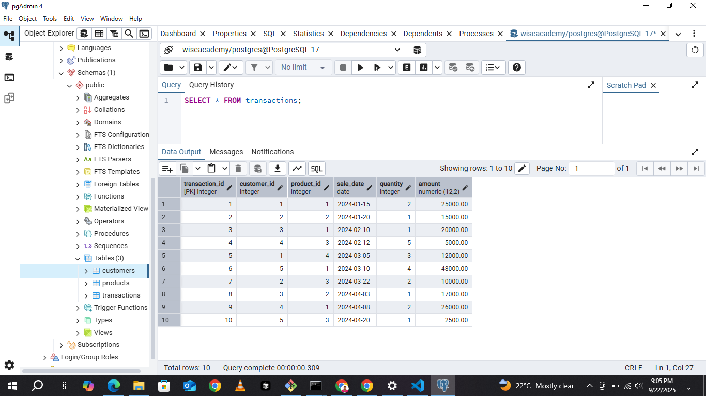
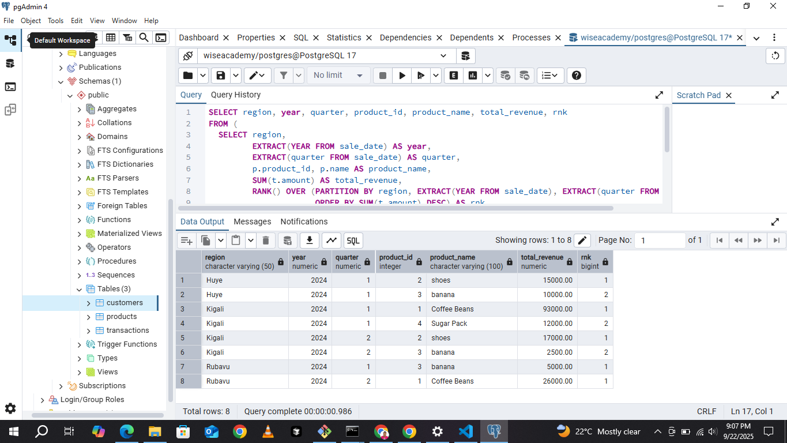
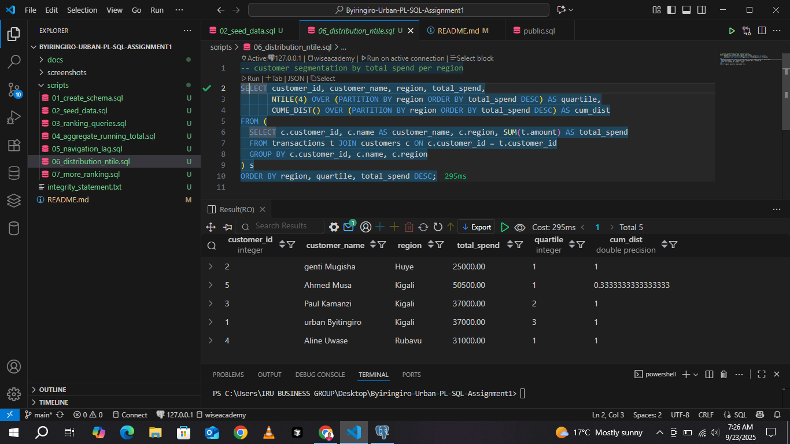
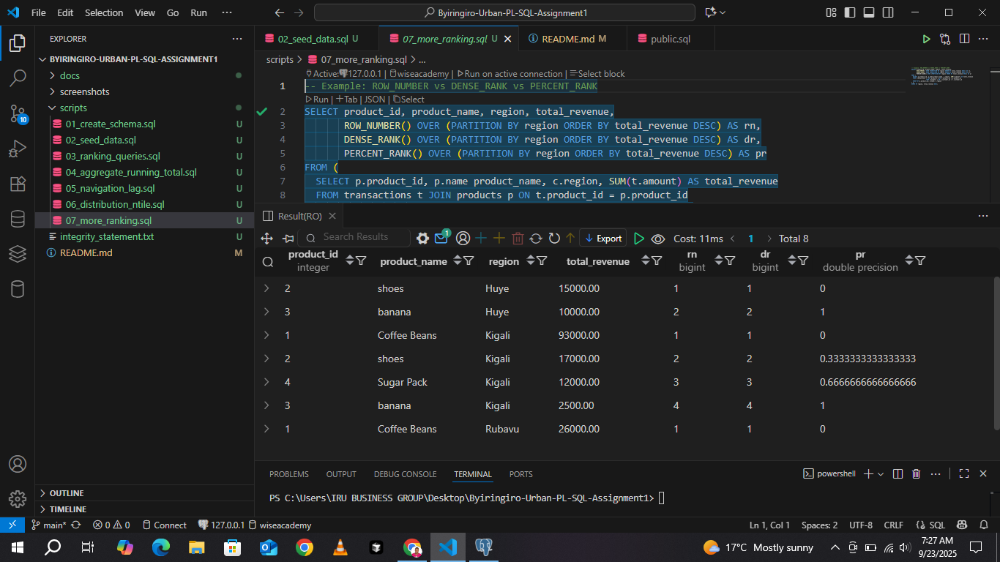

# Byiringiro-Urban-PL-SQL-Assignment1

WISE Academy Database Assignment
Table of Contents

Project Overview

Problem Definition

Business Context

Database Design

Tables

Installation & Setup

Usage

SQL Queries & Examples

Author

Project Overview

This project is a PostgreSQL-based database assignment for WISE Academy, designed to manage and analyze data for a small educational business scenario. The database covers customers, products, and transactions, and it demonstrates the use of advanced SQL ranking functions such as ROW_NUMBER(), DENSE_RANK(), and PERCENT_RANK().

Problem Definition

The goal of this assignment is to create a relational database that allows WISE Academy to:

Track customers and their information.

Manage products (courses or educational materials).

Record and analyze transactions (sales or course enrollments).

Apply SQL ranking functions for reporting, such as identifying top customers, highest selling products, or transaction trends.

Measurable Objective:

Generate a report ranking customers by total purchases using ROW_NUMBER() and DENSE_RANK().

Determine customer percentile ranking using PERCENT_RANK().

Business Context

WISE Academy is an educational platform offering short-term programming and technology courses. It aims to improve students’ technical skills and track their progress using a relational database.

The database ensures data integrity, easy reporting, and business intelligence insights.

Database Design

The database schema contains three primary tables:

customers – Stores information about students and customers.

products – Stores course offerings and educational materials.

transactions – Tracks all purchases and enrollments.

Relationships:

Each transaction is linked to a customer and a product.

Customers may have multiple transactions.

Products may be purchased multiple times.

Tables
1. customers
Column	Type	Description
customer_id	SERIAL	Primary Key
first_name	VARCHAR(50)	Customer first name
last_name	VARCHAR(50)	Customer last name
email	VARCHAR(100)	Customer email
phone	VARCHAR(20)	Customer phone number
2. products
Column	Type	Description
product_id	SERIAL	Primary Key
name	VARCHAR(100)	Product/Course name
price	NUMERIC(10,2)	Price of the product
3. transactions
Column	Type	Description
transaction_id	SERIAL	Primary Key
customer_id	INT	Foreign Key -> customers
product_id	INT	Foreign Key -> products
quantity	INT	Number of products purchased
transaction_date	DATE	Date of transaction
Installation & Setup

Install PostgreSQL from https://www.postgresql.org/download/
.

Open pgAdmin or use the psql CLI.

Create the database:

CREATE DATABASE wiseacademy;

Connect to the database and create tables using SQL scripts (provided in tables.sql).

Populate tables with sample data (provided in sample_data.sql).

Usage

Connect to the database using psql or pgAdmin.

Run queries to manage customers, products, and transactions.

Apply ranking functions for analytics:

-- Example: Rank customers by total transactions
SELECT 
    c.customer_id,
    c.first_name,
    c.last_name,
    SUM(t.quantity * p.price) AS total_spent,
    ROW_NUMBER() OVER (ORDER BY SUM(t.quantity * p.price) DESC) AS rank,
    DENSE_RANK() OVER (ORDER BY SUM(t.quantity * p.price) DESC) AS dense_rank,
    PERCENT_RANK() OVER (ORDER BY SUM(t.quantity * p.price) DESC) AS percent_rank
FROM customers c
JOIN transactions t ON c.customer_id = t.customer_id
JOIN products p ON t.product_id = p.product_id
GROUP BY c.customer_id, c.first_name, c.last_name;

View tables:

SELECT * FROM customers;
SELECT * FROM products;
SELECT * FROM transactions;

SQL Queries & Examples

Ranking top customers

Calculating percentiles for purchases

Identifying most popular products

Some screenshoot images 

Author

BYIRINGIRO Urban Bobola
Student & Developer | WISE Academy