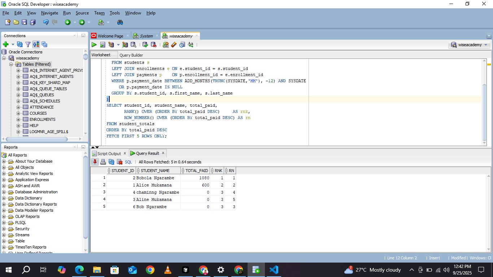
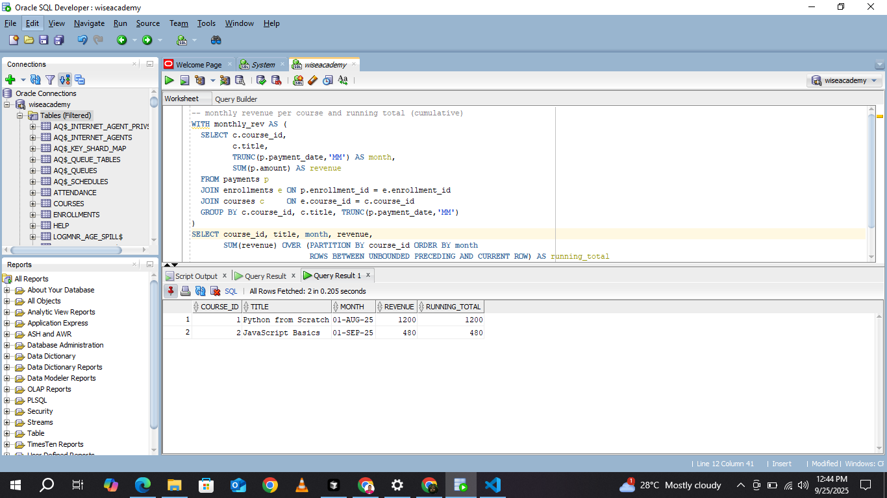
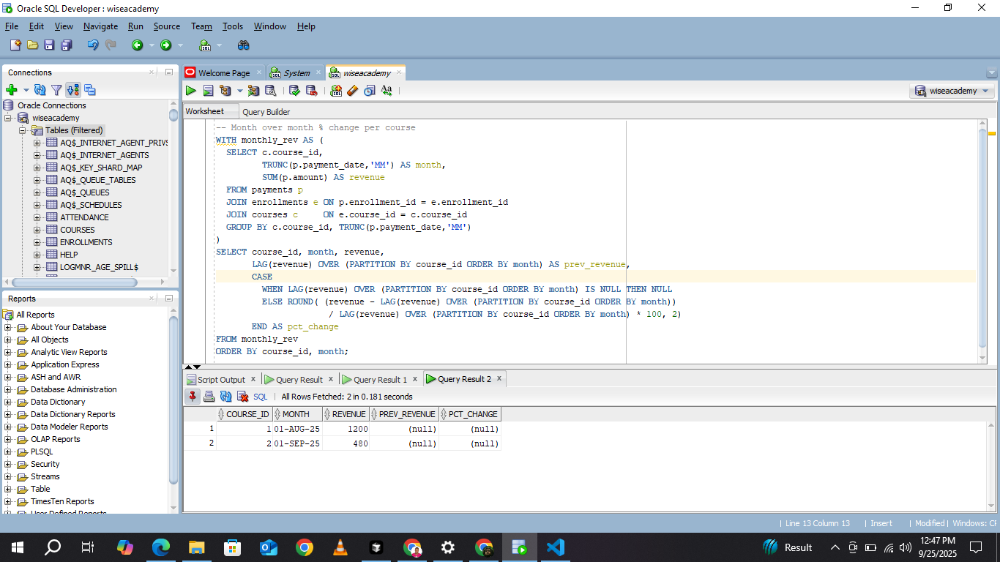
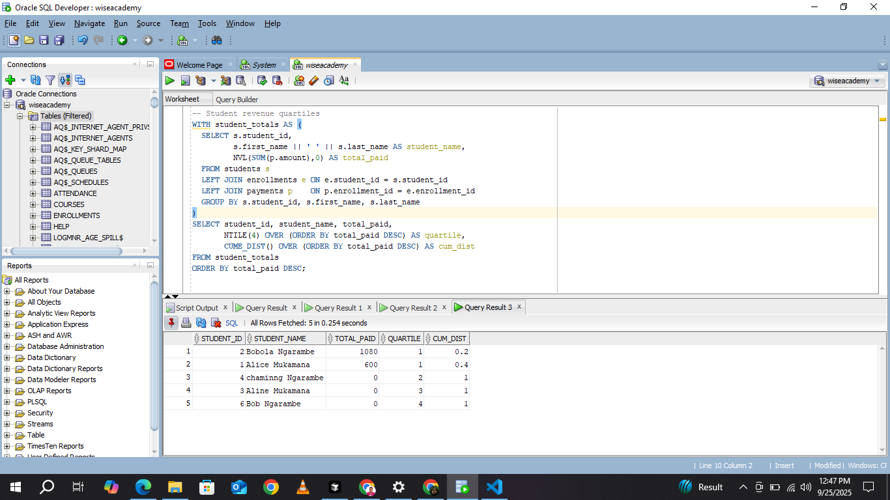
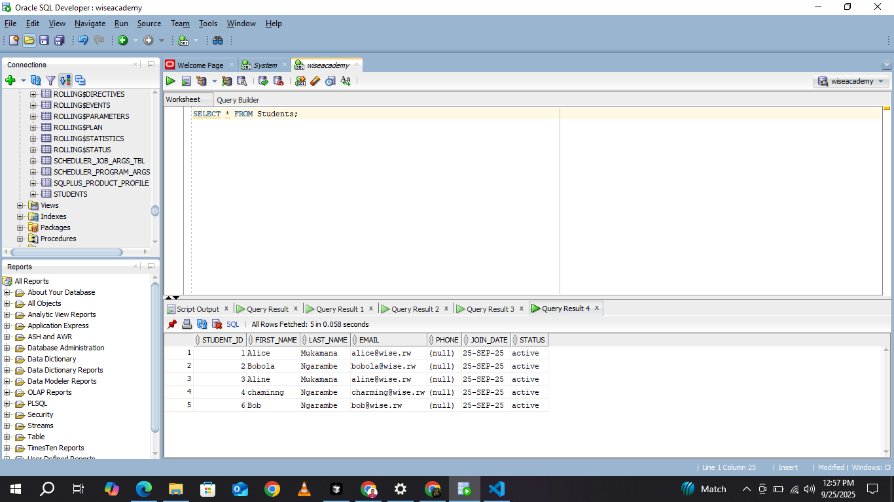
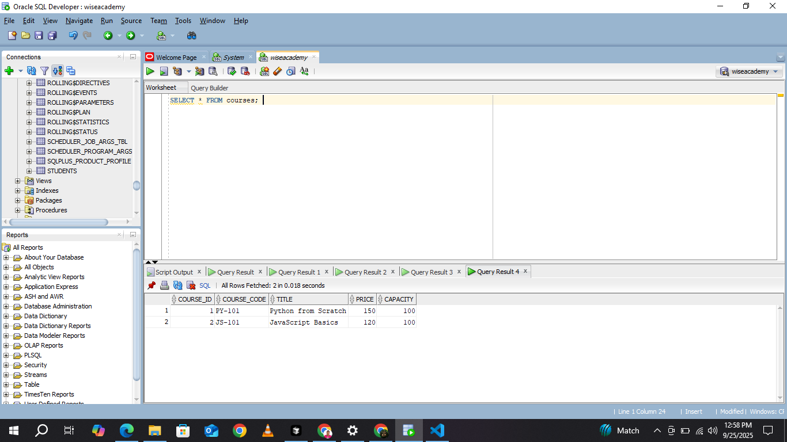
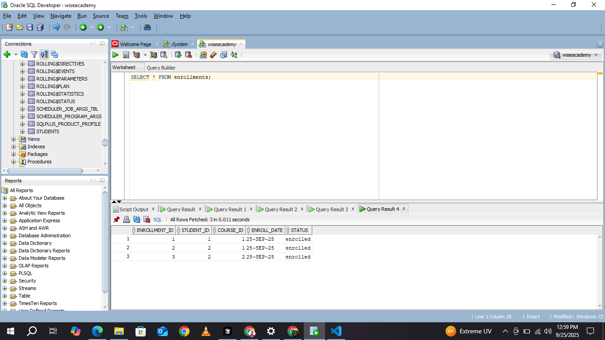
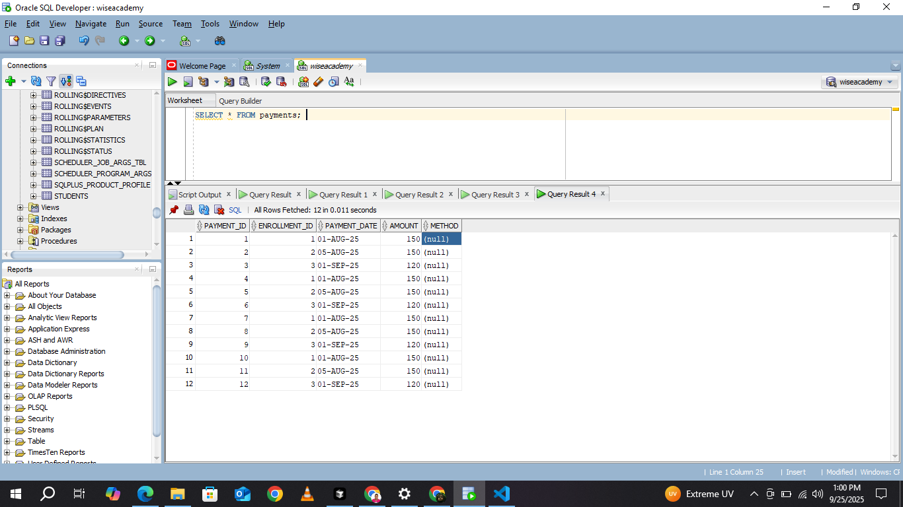

Byiringiro-Urban-PL-SQL-Assignment1
WISE Academy Database Assignment (Oracle)
Table of Contents

Project Overview

Problem Definition

Business Context

Database Design

Tables (Oracle types)

Installation & Setup (Oracle)

Usage

SQL Scripts included in this repo

SQL Examples (Oracle syntax)

Screenshots

[text](screenshots)

Author

Project Overview

This project is an Oracle Database implementation of the WISE Academy assignment. instructions and SQL with Oracle-compatible DDL, sample data and analytic queries (window functions). The schema models customers (students), products (courses), and transactions (enrollments/payments) and demonstrates Oracle PL/SQL / analytic functions such as ROW_NUMBER(), DENSE_RANK(), PERCENT_RANK(), LAG(), and SUM() OVER (...).

Problem Definition

Wise Academy needs a reliable relational database to:

Track students and their contact information.

Manage course offerings and prices.

Record enrollments/payments and analyze revenue and student rankings.

Measurable objectives

Rank customers by total spending using ROW_NUMBER() / DENSE_RANK().

Determine customer percentile via PERCENT_RANK().

Produce monthly and cumulative revenue per course (using analytic functions).

Business Context

WISE Academy offers short-term programming and technology courses and requires accurate reporting to make decisions on marketing, scheduling and resource allocation. Moving from spreadsheets to an Oracle relational database ensures data integrity, easier reporting and the ability to run advanced analytics.

Database Design

Entities

customers — students / customers

products — courses or educational materials

transactions — purchases or enrollments with quantity and date

Relationships

Each transaction links to a customer and a product.

Customers may have multiple transactions; products may be purchased multiple times.

Tables (Oracle data types)
1. customers
Column	Type	Description
customer_id	NUMBER GENERATED BY DEFAULT ON NULL AS IDENTITY	Primary Key
first_name	VARCHAR2(50)	Customer first name
last_name	VARCHAR2(50)	Customer last name
email	VARCHAR2(100)	Customer email
phone	VARCHAR2(20)	Customer phone number
2. products
Column	Type	Description
product_id	NUMBER GENERATED BY DEFAULT ON NULL AS IDENTITY	Primary Key
name	VARCHAR2(100)	Product / Course name
price	NUMBER(10,2)	Price of the product
3. transactions
Column	Type	Description
transaction_id	NUMBER GENERATED BY DEFAULT ON NULL AS IDENTITY	Primary Key
customer_id	NUMBER	Foreign Key → customers(customer_id)
product_id	NUMBER	Foreign Key → products(product_id)
quantity	NUMBER	Number of products purchased
transaction_date	DATE	Date of transaction (defaults to SYSDATE)
Example Oracle DDL (create these in sql/01_create_schema.sql)
-- Create tables (run as the schema user, e.g., WISEACADEMY)
CREATE TABLE customers (
  customer_id NUMBER GENERATED BY DEFAULT ON NULL AS IDENTITY PRIMARY KEY,
  first_name  VARCHAR2(50) NOT NULL,
  last_name   VARCHAR2(50) NOT NULL,
  email       VARCHAR2(100),
  phone       VARCHAR2(20)
);

CREATE TABLE products (
  product_id NUMBER GENERATED BY DEFAULT ON NULL AS IDENTITY PRIMARY KEY,
  name       VARCHAR2(100) NOT NULL,
  price      NUMBER(10,2) DEFAULT 0
);

CREATE TABLE transactions (
  transaction_id   NUMBER GENERATED BY DEFAULT ON NULL AS IDENTITY PRIMARY KEY,
  customer_id      NUMBER NOT NULL,
  product_id       NUMBER NOT NULL,
  quantity         NUMBER DEFAULT 1,
  transaction_date DATE DEFAULT SYSDATE,
  CONSTRAINT fk_tr_customer FOREIGN KEY (customer_id) REFERENCES customers(customer_id),
  CONSTRAINT fk_tr_product  FOREIGN KEY (product_id)  REFERENCES products(product_id)
);

Notes:

Oracle uses NUMBER and VARCHAR2 rather than PostgreSQL SERIAL/VARCHAR.

GENERATED ... AS IDENTITY replaces sequences + triggers for simple auto-increment behavior.

Installation & Setup (Oracle)

Install Oracle Database: For local development use Oracle Database Express Edition (XE). Choose a version compatible with your OS (e.g., Oracle Database XE 21c or 18c). Install instructions are available on Oracle's website.

Install a client: Install Oracle SQL Developer (GUI) or use sqlplus for the CLI.

Create a working schema/user (run as a privileged user like SYS or SYSTEM):

-- Example: create a schema user for the assignment
CREATE USER wiseacademy IDENTIFIED BY wisepass;
-- Grant required privileges (grant only what you need in production)
GRANT CREATE SESSION, CREATE TABLE, CREATE VIEW, CREATE SEQUENCE, CREATE PROCEDURE, CREATE TRIGGER TO wiseacademy;

Connect as the new user in SQL Developer or SQL*Plus and run the SQL scripts in the sql/ folder:

-- connect (SQL*Plus example)
-- sqlplus wiseacademy/wisepass@localhost/XEPDB1
@sql/01_create_schema.sql
@sql/02_sample_inserts.sql
@sql/03_window_queries.sql
SQL Scripts included in this repo

sql/01_create_schema.sql — Oracle DDL (tables + constraints)

sql/02_sample_inserts.sql — sample INSERT statements for quick testing

sql/03_window_queries.sql — analytic/window function examples and queries

Usage

Open SQL Developer or connect with SQL*Plus and run the sample queries in sql/03_window_queries.sql. The queries are written using Oracle-compatible syntax and sample datasets.

View tables

SELECT * FROM customers;
SELECT * FROM products;
SELECT * FROM transactions;
SQL Examples (Oracle syntax)
Rank customers by total spending (using a CTE then analytic functions)
WITH customer_totals AS (
  SELECT c.customer_id,
         c.first_name,
         c.last_name,
         NVL(SUM(t.quantity * p.price), 0) AS total_spent
  FROM customers c
  JOIN transactions t ON c.customer_id = t.customer_id
  JOIN products p ON t.product_id = p.product_id
  GROUP BY c.customer_id, c.first_name, c.last_name
)
SELECT customer_id,
       first_name,
       last_name,
       total_spent,
       ROW_NUMBER() OVER (ORDER BY total_spent DESC)  AS rn,
       DENSE_RANK() OVER (ORDER BY total_spent DESC) AS dense_rank,
       PERCENT_RANK() OVER (ORDER BY total_spent DESC) AS percent_rank
FROM customer_totals
ORDER BY total_spent DESC;
Monthly revenue per product and running total
WITH monthly_rev AS (
  SELECT p.product_id,
         p.name,
         TRUNC(t.transaction_date, 'MM') AS month,
         SUM(t.quantity * p.price) AS revenue
  FROM transactions t
  JOIN products p ON t.product_id = p.product_id
  GROUP BY p.product_id, p.name, TRUNC(t.transaction_date, 'MM')
)
SELECT product_id,
       name,
       month,
       revenue,
       SUM(revenue) OVER (PARTITION BY product_id ORDER BY month
                          ROWS BETWEEN UNBOUNDED PRECEDING AND CURRENT ROW) AS running_total
FROM monthly_rev
ORDER BY product_id, month;

Notes:

Use TRUNC(date_col, 'MM') to aggregate by month in Oracle.

Use ROWS framing for moving windows by bucketed rows (months).

Screenshots

Place screenshots from your Oracle SQL Developer runs in the screenshots/ folder. Example images already referenced in the original repo:

Author

BYIRINGIRO Urban Bobola
Student & Developer | WISE Academy